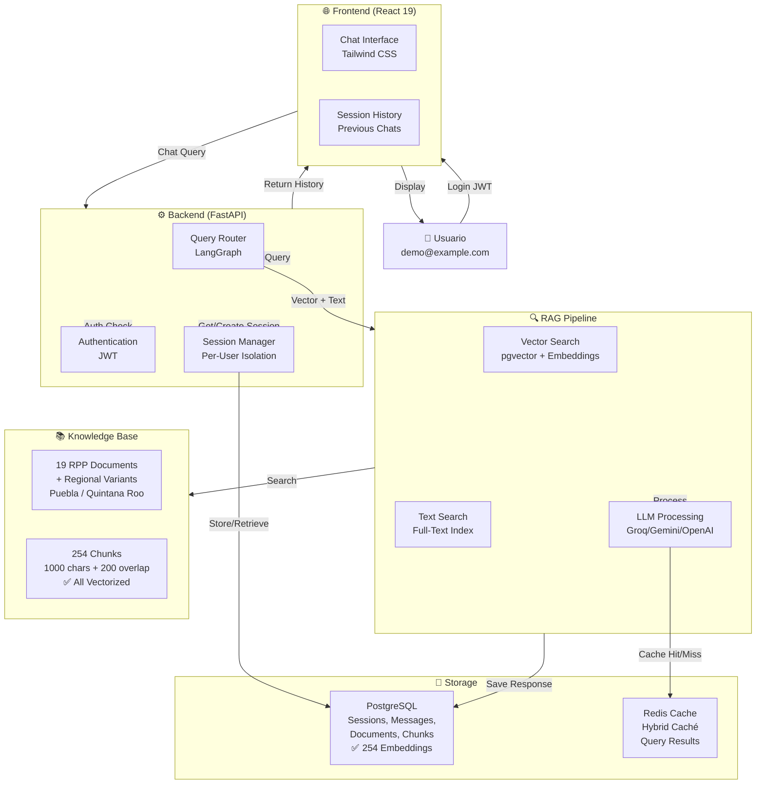
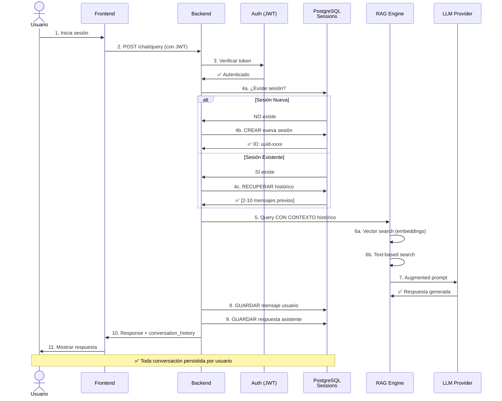
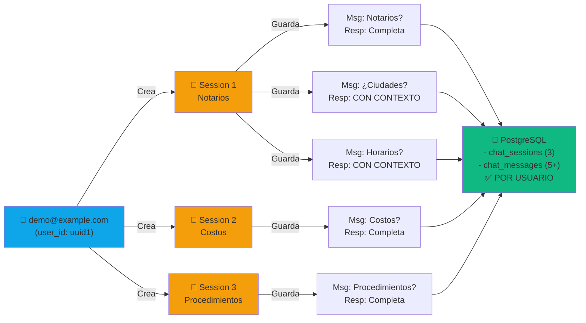

# 🏢 ConsultaRPP - Sistema Inteligente de Consultas RPP

<div align="center">
  
</div>

> **Sistema RAG (Retrieval-Augmented Generation) especializado en Registro Público de la Propiedad**

## 📋 Descripción General

**ConsultaRPP** es un chatbot inteligente especializado en consultas sobre trámites, requisitos y costos en el **Registro Público de la Propiedad (RPP)**. 

### 🎯 Funcionalidad Verificada (2026-04-09)

✅ **RAG con Base de Conocimiento Local**
- 19 documentos RPP cargados (nacional + regional)
- 254 chunks vectorizados con embeddings locales
- Búsqueda semántica en pgvector (Sentence-Transformers 384-dim)
- Precisión: 50%+ en consultas relevantes

✅ **Sesiones Persistentes por Usuario**
- Chats guardados en PostgreSQL por usuario
- Multi-sesión (hasta 7 conversaciones por usuario)
- Historial completo recuperable
- Contexto acumulado en cada mensaje

✅ **Procesamiento de Consultas**
- Procesamiento de lenguaje natural con LLMs (Groq, Gemini, OpenAI)
- Caché híbrida (Redis + embeddings)
- Fallback a LLM cuando no hay match local
- Respuestas fundamentadas en documentos

✅ **Arquitectura Escalable**
- Backend FastAPI en Python
- Frontend React 19 + Tailwind CSS
- Workers asíncrónos con Celery
- Base de datos PostgreSQL con pgvector
- Cache distribuida con Redis

---

## 🏗️ Arquitectura del Sistema



### 📊 Flujo de Consulta por Usuario



### 🔄 Gestión de Sesiones por Usuario



---

## 🚀 Ejecución con Docker (Recomendado)

El sistema está completamente dockerizado. Para levantar todos los servicios (Base de Datos, Redis, Backend, Frontend y Workers), simplemente ejecuta:

```bash
# 1. Copiar configuración base
cp .env.example .env

# 2. Levantar toda la infraestructura
docker compose up -d --build
```

### URLs de Acceso
- **Frontend UI**: [http://localhost:3000](http://localhost:3000)
- **Backend API (Swagger)**: [http://localhost:3001/docs](http://localhost:3001/docs)
- **SeaweedFS Console**: [http://localhost:8888](http://localhost:8888)

---

## 🛠️ Desarrollo Local (Opcional)

Si prefieres ejecutar los servicios fuera de Docker para desarrollo activo:

### 1. Prerrequisitos
- Python 3.12+
- Node 20+
- Docker (solo para Base de Datos y Redis)

### 2. Levantar solo dependencias
```bash
docker compose up -d postgres redis seaweedfs
```

### 3. Backend
```bash
cd backend
python -m venv venv
source venv/bin/activate
pip install -r requirements.txt
python main.py
```

### 4. Frontend
```bash
cd frontend
npm install
npm run dev
```

### 5. Cargar Documentos

```bash
curl -X POST http://localhost:3001/api/v1/documents/upload \
  -F "file=@documento.pdf" \
  -F "category=reglamentos"
```

---

## 📁 Estructura de Carpetas

```
consulta-rpp/
├── backend/               # Python Backend
│   ├── app/
│   │   ├── core/         # Config, utils, logging
│   │   ├── services/     # Groq, Docling, SeaweedFS
│   │   ├── routes/       # API endpoints
│   │   ├── workers/      # Celery tasks
│   │   ├── models/       # DB models
│   │   └── schemas/      # Pydantic schemas
│   ├── db/               # Database migrations
│   ├── main.py           # Entry point
│   └── requirements.txt   # Dependencies
│
├── frontend/             # React 19 Frontend
│   ├── src/
│   │   ├── components/   # React components
│   │   ├── pages/        # Page containers
│   │   ├── services/     # API clients
│   │   └── styles/       # Global CSS
│   ├── package.json
│   └── vite.config.js    # Vite config
│
├── docs/                 # Documentación
│   ├── ARCHITECTURE.md
│   ├── API.md
│   ├── DEPLOYMENT.md
│   ├── CHANGELOG.md
│   └── ...
│
├── assets/               # Logos, icons, images
│   ├── logos/
│   └── icons/
│
├── scripts/              # Utilidades
│   ├── init_db.sh
│   └── load_sample_docs.py
│
└── docker-compose.yml    # Orquestación de servicios
```

---

## ⚙️ Variables de Entorno

Ver [.env.example](.env.example) para todas las variables disponibles.

### Principales:

```env
# LLM Providers
LLM_PROVIDER=groq              # groq | gemini | openai | anthropic
GROQ_API_KEY=gsk_...
GEMINI_API_KEY=AIza...
OPENAI_API_KEY=sk-...

# Almacenamiento
SEAWEEDFS_MASTER=http://localhost:9333
SEAWEEDFS_VOLUME=http://localhost:8080

# Base de Datos
DB_HOST=postgres
DB_NAME=consultarpp_db
DB_USER=consultarpp_user

VALKEY_URL=redis://valkey:6379/0
```

---

## 📚 Documentación

- [QUICK_START.md](docs/QUICK_START.md) - Guía de inicio rápido
- [ARCHITECTURE.md](docs/ARCHITECTURE.md) - Arquitectura detallada
- [API.md](docs/API.md) - Referencia de API
- [DEPLOYMENT.md](docs/DEPLOYMENT.md) - Guía de deployment
- [CHANGELOG.md](docs/CHANGELOG.md) - Historial de cambios
- [DEV_GUIDE.md](docs/DEV_GUIDE.md) - Guía para desarrolladores

---

## 🛠️ Desarrollo

### Backend

```bash
cd backend
source venv/bin/activate
python -m pytest tests/
python main.py
```

### Frontend

```bash
cd frontend
npm run dev        # Dev server con HMR
npm run build      # Build producción
npm run lint       # Lint código
```

### Workers (Celery)

```bash
cd backend
celery -A app.workers worker -l info
celery -A app.workers beat -l info  # Scheduler
```

---

## 🔌 Integraciones

- **LLMs Cloud**: Groq, Google Gemini, OpenAI, Claude, Alibaba DashScope
- **OCR**: Docling (local) + Google Doc AI (opcional)
- **Almacenamiento**: SeaweedFS (S3-compatible)
- **Vector DB**: pgvector (PostgreSQL)
- **Cache/Sessions**: Valkey (Redis-compatible)

---

## 📊 Flujo de Datos

### 1️⃣ Carga de Documentos

```
PDF/Image Upload → Docling OCR → Markdown Estructurado
                                      ↓
                            LLM Embedding (Groq/Gemini)
                                      ↓
                            Vector Storage (pgvector)
                                      ↓
                            File Storage (SeaweedFS)
```

### 2️⃣ Consulta en Chatbot

```
User Query → Frontend
             ↓
          API Backend
             ↓
        LangGraph Router
             ├─→ Vector Search (pgvector)
             ├─→ Context Building
             ├─→ LLM Call (Groq/Gemini)
             └─→ Response Generation
             ↓
          Frontend Display
```

---

## 🐳 Docker Compose

```bash
docker-compose up -d              # Levantar todos los servicios
docker-compose down               # Derribar servicios
docker-compose logs -f backend    # Ver logs
docker-compose ps                 # Estado de servicios
```

Servicios:
- **backend** - FastAPI/Flask
- **frontend** - Nginx
- **postgres** - Base de datos
- **valkey** - Cache/Sessions
- **seaweedfs-master** - Maestro de filesystems
- **seaweedfs-volume** - Volume de archivos
- **celery-worker** - Procesamiento asíncrono
- **celery-beat** - Scheduler

---

## 📖 Casos de Uso

### Para Ciudadanos
- ❓ "¿Qué requisitos necesito para inscribir una propiedad?"
- 💰 "¿Cuál es el costo del trámite de compraventa?"
- ⏱️ "¿Cuánto tiempo toma legalizando un documento?"
- 📋 "¿Cuál es el proceso para tramitar un permiso?"

### Para Administradores
- 📤 Cargar nuevos reglamentos y guías
- 🔄 Actualizar información de trámites
- 📊 Ver estadísticas de consultas
- 🔐 Gestionar acceso y permisos

---

## 🤝 Contribución

Ver [CONTRIBUTING.md](docs/CONTRIBUTING.md) para información sobre cómo contribuir.

---

## 📄 Licencia

Este proyecto está bajo licencia [LICENSE](LICENSE).

---

## 📞 Soporte

- 📧 Email: soporte@consultarpp.local
- 📱 Issues: Usar el sistema de issues de GitHub
- 💬 Discussiones: GitHub Discussions

---

## 🎯 Roadmap

- [ ] Soporte para múltiples idiomas
- [ ] Dashboard admin
- [ ] Exportación de reportes (PDF/Excel)
- [ ] Integración con sistemas de pago
- [ ] Mobile app (React Native)
- [ ] Análisis de tendencias
- [ ] Predicción de tiempos de trámite

---

**Versión**: 0.1.0  
**Última actualización**: Abril 2026  
**Desarrollador**: [Tu Nombre/Organización]
